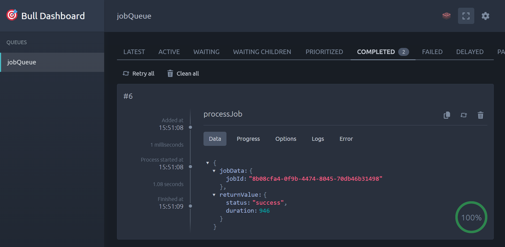

# Async Report Engine


A decoupled, queue-based job processing system built around production patterns — offloading CPU-bound work from the Node.js event loop using Redis-backed queues, isolated worker containers, and multi-worker concurrency.

---

## At a Glance

- CPU-bound work offloaded from the API to isolated worker processes via BullMQ + Redis
- API stays responsive under load — workers handle computation in separate containers
- Tested at ~100 req/sec: synchronous handling caused ~97% timeouts; queue-based architecture handled the same load with zero failures
- Includes retry with exponential backoff, rate limiting, graceful shutdown, structured logging, and a live queue dashboard

---

## The Problem

Node.js runs on a single-threaded event loop. Running CPU-heavy logic directly inside an HTTP handler blocks the loop entirely — the server cannot respond to anything else while it is computing. Under sustained load this causes cascading timeouts and full unresponsiveness.

This project simulates heavy report generation workloads under high traffic and demonstrates how a queue-based architecture prevents API downtime. The API only validates and enqueues jobs — isolated worker processes handle all computation asynchronously.

This pattern appears in real systems handling report generation, video encoding, AI inference, and payment processing pipelines — anywhere a task is too slow to live inside a request-response cycle.

---

## Performance Results

Tested with Artillery at ~100 req/sec using 100M math iterations per job on a single host (16 cores, 24GB RAM, Docker on WSL 2).

| Phase                            | Architecture                  | Success Rate   | Finding                                                                                           |
| :------------------------------- | :---------------------------- | :------------- | :------------------------------------------------------------------------------------------------ |
| **1 — Sync**                     | Blocking, single-threaded     | ~3.4%          | Event loop blocked — nearly every request timed out                                               |
| **2 — 1 Worker**                 | Decoupled worker process      | ~91.4%         | Queue absorbed burst; single worker saturated under load                                          |
| **3 — 3 Workers + Rate Limiter** | Multi-worker (3 replicas)     | ~9.7% accepted | **Low rate is intentional** — rate limiter rejected excess traffic, not an infrastructure failure |
| **3 — 3 Workers (no limiter)**   | Multi-worker (3 replicas)     | ~100%          | Zero failures, 46ms mean latency — architecture scales cleanly                                    |

The key finding: the same workload that caused 99% failure synchronously was handled with zero failures once offloaded to workers. The ~9.7% in the rate-limited run was the rate limiter working as designed — not a system failure.

Full analysis: [docs/performance-baseline.md](docs/performance-baseline.md)

---

## Architecture

```
Client → [Express API] ─────────────────────────────► [PostgreSQL]
              │                                              ▲
              ▼                                              │
          [BullMQ] ──► [Redis] ──► [Worker Process(es)] ────┘
              ▲
              │
           (poll status)
              │
           Client
```

1. Client creates a user, then submits a job via `POST /api/jobs`
2. API validates the request with Zod and enqueues it into BullMQ
3. Redis stores the queue state and manages job lifecycle
4. Worker processes pick up jobs from the queue (concurrency: 4 per worker)
5. The processor runs 100M iterations of CPU-bound math, reporting progress at 30%, 80%, and 100%
6. Job status transitions (`PENDING → PROCESSING → COMPLETED / FAILED`) are written to PostgreSQL by both the API (on create) and the worker (on progress and completion)
7. Client polls `GET /api/jobs/:jobId` for status and results

The API and worker run as **separate containers** — compute pressure on the worker never reaches the API event loop.

---

## Tech Stack

| Layer            | Technology                   |
| :--------------- | :---------------------------- |
| API Framework    | Node.js, Express, TypeScript |
| Queue / Broker   | BullMQ, Redis 7              |
| Database / ORM   | PostgreSQL 15, Prisma        |
| Validation       | Zod                          |
| Auth             | API key middleware            |
| Rate Limiting    | express-rate-limit           |
| Logging          | Pino                         |
| Observability    | BullBoard                    |
| Containerization | Docker, Docker Compose       |
| Load Testing     | Artillery                    |

---

## Getting Started

**Prerequisites**: Docker and Docker Compose.

```bash
git clone https://github.com/poojithpagadekal/async-report-engine.git
cd async-report-engine
docker compose up --build
```

| Service             | URL                                |
| :------------------ | :--------------------------------- |
| API                 | http://localhost:5000              |
| Swagger docs        | http://localhost:5000/docs         |
| BullBoard dashboard | http://localhost:5000/admin/queues |

To run with multiple workers (matches the Phase 3 benchmark):

```bash
# Linux / macOS
WORKER_REPLICAS=3 docker compose up --build

# Windows PowerShell
$env:WORKER_REPLICAS=3; docker compose up --build
```

---

## Trying the API

This is a JSON API — opening the base URL in a browser shows `Cannot GET /` which is expected. Use the Swagger UI or curl to interact with it.

### Option A — Swagger UI (recommended)

Open `http://localhost:5000/docs`. Click **Authorize** and enter your API key before making requests.

Jobs require a valid user ID, so follow this sequence:

**Step 1 — Create a user**

`POST /api/users → Try it out`, then Execute:

```json
{
  "email": "test@example.com",
  "name": "Test User"
}
```

Copy the `id` from the response — you need it in the next step.

**Step 2 — Submit a job**

`POST /api/jobs → Try it out`, paste the `id` as `userId`:

```json
{
  "userId": "<paste-id-here>",
  "title": "Q4 Sales Report",
  "type": "PDF_EXPORT"
}
```

`type` must be one of: `SALES_REPORT`, `USER_ANALYTICS`, `PDF_EXPORT`.

**Step 3 — Poll for status**

Use `GET /api/jobs/{jobId}` to check the job. It moves from `PENDING → PROCESSING → COMPLETED` within a few seconds. Watch it move through the queue in real time at `http://localhost:5000/admin/queues`.

### Option B — curl

```bash
# 1. Create a user
curl -X POST http://localhost:5000/api/users \
  -H "Content-Type: application/json" \
  -H "x-api-key: your-api-key" \
  -d '{"email": "test@example.com", "name": "Test User"}'

# 2. Submit a job — replace  with the id from step 1
curl -X POST http://localhost:5000/api/jobs \
  -H "Content-Type: application/json" \
  -H "x-api-key: your-api-key" \
  -d '{"userId": "<paste-id-here>", "title": "Q4 Sales Report", "type": "PDF_EXPORT"}'

# 3. Poll for status
curl "http://localhost:5000/api/jobs?page=1&limit=10"
```

---

## API Reference

All routes are prefixed with `/api`. Write endpoints require an `x-api-key` header.

### Users

| Method | Endpoint     | Auth     | Description                   |
| :----- | :----------- | :------- | :---------------------------- |
| `POST` | `/api/users` | Required | Create a new user             |
| `GET`  | `/api/users` | —        | List all users and their jobs |

### Jobs

| Method | Endpoint                    | Auth     | Description                                 |
| :----- | :-------------------------- | :------- | :------------------------------------------ |
| `POST` | `/api/jobs`                 | Required | Submit a new job (rate limited: 50 req/min) |
| `GET`  | `/api/jobs?page=1&limit=10` | —        | List jobs paginated                         |
| `GET`  | `/api/jobs/:jobId`          | —        | Get a single job by ID                      |

---

## Resilience Features

**Graceful shutdown** — on `SIGTERM`, the system stops the HTTP server first, waits for any active worker job to finish, then disconnects Prisma. A 30-second force-exit timer acts as a safety net.

**Retry with exponential backoff** — jobs are retried up to 5 times with `10s × 2ⁿ` delays, handling transient DB or network errors without immediately marking a job as failed.

**Rate limiting** — `POST /api/jobs` is capped at 50 requests per minute. This intentionally controls the ingestion rate to prevent the queue from growing faster than workers can drain it.

**Input validation** — every endpoint uses a Zod middleware that validates, sanitizes, and strips unknown fields before the request reaches the controller.

**API key auth** — write endpoints are protected by an API key middleware. Requests without a valid `x-api-key` header are rejected with `401`.

---

## Observability

**Pino logging** — every request gets a unique `requestId`. Worker logs include `jobId` and `attempt` number. All logs are structured NDJSON, easy to filter by field in any log aggregator.

**BullBoard** — live queue dashboard at `http://localhost:5000/admin/queues`. Shows active, completed, delayed, and failed jobs in real time.



---

## Future Improvements

- Add WebSocket-based status updates to replace client polling
- Implement priority queues so urgent job types skip ahead of the queue
- Add distributed Redis setup (Redis Cluster or Sentinel) for high availability
- Scope API keys per user so each client has its own rate limit and audit trail

---

## Live Demo

> This is a JSON API — opening the base URL in a browser will show `Cannot GET /`. Use the Swagger UI link below.

| Service             | URL                                                   |
| :------------------ | :---------------------------------------------------- |
| Swagger UI          | https://async-report-engine.onrender.com/docs         |
| BullBoard Dashboard | https://async-report-engine.onrender.com/admin/queues |

**Free tier note** — the first request may take 30–50 seconds to wake the server after inactivity. If Swagger times out on the first try, wait a few seconds and retry.

Follow the same Swagger sequence above — create a user first, copy the `id`, then submit a job.
